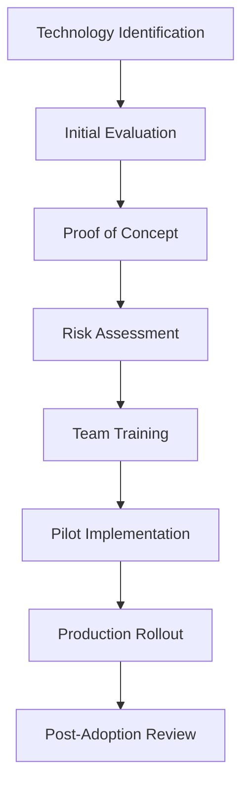

# Modernization Roadmap

## Overview

This document outlines the strategic modernization plan for the Agentic Startup Studio Boilerplate, focusing on adopting cutting-edge technologies and practices to maintain competitive advantage.

## Current Technology Assessment

### Technology Stack Status

| Component | Current Version | Latest Version | Status | Priority |
|-----------|----------------|----------------|---------|-----------|
| Python | 3.9+ | 3.12 | ✅ Current | Medium |
| FastAPI | 0.108.0 | 0.110.0+ | ⚠️ Minor update | Low |
| React | 18.x | 18.x | ✅ Current | Low |
| Node.js | 18.x | 20.x LTS | ⚠️ LTS update | Medium |
| PostgreSQL | 15.x | 16.x | ⚠️ Major update | High |
| Redis | 7.x | 7.x | ✅ Current | Low |
| Docker | 24.x | 25.x | ⚠️ Minor update | Low |
| CrewAI | 0.14.0 | Latest | ⚠️ Check updates | High |

## Modernization Initiatives

### Q1 2025: Foundation Modernization

#### 1. Infrastructure Modernization
**Target**: Enhanced container orchestration and cloud-native patterns

**Deliverables**:
- [ ] **Kubernetes Manifests**: Production-ready K8s deployments
- [ ] **Helm Charts**: Parameterized application deployment
- [ ] **Service Mesh Integration**: Istio for advanced traffic management
- [ ] **Container Security**: Distroless images and security scanning

```yaml
# Example: Advanced Kubernetes deployment
apiVersion: apps/v1
kind: Deployment
metadata:
  name: agentic-backend
  labels:
    app: agentic-backend
    version: v1
spec:
  replicas: 3
  selector:
    matchLabels:
      app: agentic-backend
  template:
    spec:
      containers:
      - name: backend
        image: agentic-studio:latest
        resources:
          requests:
            memory: "256Mi"
            cpu: "250m"
          limits:
            memory: "512Mi"
            cpu: "500m"
        readinessProbe:
          httpGet:
            path: /health
            port: 8000
          initialDelaySeconds: 30
          periodSeconds: 10
```

#### 2. Database Modernization
**Target**: Enhanced performance and observability

**Deliverables**:
- [ ] **PostgreSQL 16 Upgrade**: Latest features and performance improvements
- [ ] **Connection Pooling**: PgBouncer integration
- [ ] **Read Replicas**: Horizontal read scaling
- [ ] **Database Monitoring**: Enhanced observability with pg_stat_statements

```python
# Example: Advanced database configuration
DATABASE_CONFIG = {
    "master": {
        "host": "postgres-master.cluster.local",
        "port": 5432,
        "pool_size": 20,
        "max_overflow": 0,
        "pool_pre_ping": True
    },
    "replica": {
        "host": "postgres-replica.cluster.local", 
        "port": 5432,
        "pool_size": 10,
        "read_only": True
    }
}
```

### Q2 2025: AI/ML Platform Enhancement

#### 1. Advanced AI Integration
**Target**: Next-generation AI capabilities and efficiency

**Deliverables**:
- [ ] **Multi-Model Support**: Integration with GPT-4, Claude, and local models
- [ ] **Model Serving**: MLflow or BentoML for model deployment
- [ ] **Vector Database**: Pinecone/Weaviate for semantic search
- [ ] **AI Observability**: Weights & Biases integration

```python
# Example: Advanced AI model management
class ModelManager:
    def __init__(self):
        self.models = {
            "gpt-4": OpenAIModel("gpt-4"),
            "claude-3": AnthropicModel("claude-3-sonnet"),
            "local-llama": LocalModel("llama-2-70b")
        }
        
    async def route_request(self, prompt: str, requirements: Dict):
        # Intelligent model routing based on requirements
        optimal_model = self.select_optimal_model(prompt, requirements)
        return await optimal_model.generate(prompt)
```

#### 2. Agent Architecture Evolution
**Target**: Scalable multi-agent orchestration

**Deliverables**:
- [ ] **Agent Mesh**: Distributed agent communication
- [ ] **Agent Lifecycle Management**: Dynamic scaling and resource allocation
- [ ] **Inter-Agent Protocols**: Standardized communication patterns
- [ ] **Agent Marketplace**: Pluggable agent ecosystem

### Q3 2025: Development Experience Revolution

#### 1. Advanced Development Tools
**Target**: AI-powered development workflow

**Deliverables**:
- [ ] **AI Code Assistant Integration**: GitHub Copilot Enterprise
- [ ] **Intelligent Testing**: AI-generated test cases
- [ ] **Auto-Documentation**: AI-powered documentation generation
- [ ] **Code Quality AI**: ML-based code review assistance

```yaml
# Example: AI-powered GitHub Actions workflow
name: AI-Enhanced CI/CD
on: [push, pull_request]
jobs:
  ai-analysis:
    runs-on: ubuntu-latest
    steps:
      - uses: actions/checkout@v4
      - name: AI Code Review
        uses: github/ai-code-reviewer@v1
        with:
          model: "gpt-4"
          focus: ["security", "performance", "maintainability"]
      - name: Generate Tests
        uses: github/ai-test-generator@v1
        with:
          coverage-threshold: 90
```

#### 2. Cloud-Native Development
**Target**: Serverless and edge computing capabilities

**Deliverables**:
- [ ] **Serverless Functions**: AWS Lambda/Vercel functions
- [ ] **Edge Computing**: Cloudflare Workers integration
- [ ] **JAMstack Architecture**: Static site generation with dynamic capabilities
- [ ] **Progressive Web App**: Enhanced mobile experience

### Q4 2025: Security and Compliance Enhancement

#### 1. Zero-Trust Security
**Target**: Comprehensive security posture

**Deliverables**:
- [ ] **Zero-Trust Architecture**: Identity-based security model
- [ ] **Advanced RBAC**: Attribute-based access control
- [ ] **Security Automation**: Automated threat detection and response
- [ ] **Compliance Dashboard**: Real-time compliance monitoring

```python
# Example: Zero-trust security implementation
class ZeroTrustAuth:
    def __init__(self):
        self.policy_engine = PolicyEngine()
        self.risk_assessor = RiskAssessor()
        
    async def authorize_request(self, user, resource, context):
        # Continuous authorization based on risk assessment
        risk_score = await self.risk_assessor.assess(user, context)
        policy_result = await self.policy_engine.evaluate(user, resource, risk_score)
        return policy_result.allow and risk_score < RISK_THRESHOLD
```

#### 2. Advanced Observability
**Target**: Full-stack observability and AIOps

**Deliverables**:
- [ ] **Distributed Tracing**: OpenTelemetry full implementation
- [ ] **AIOps Integration**: ML-powered incident detection
- [ ] **Custom Metrics**: Business-specific KPI tracking
- [ ] **Synthetic Monitoring**: Proactive performance testing

## Technology Adoption Framework

### Evaluation Criteria

Each new technology is evaluated against:

1. **Strategic Alignment** (Weight: 30%)
   - Business value delivery
   - Competitive advantage
   - Market demand

2. **Technical Merit** (Weight: 25%)
   - Performance improvements
   - Developer productivity
   - Maintainability

3. **Risk Assessment** (Weight: 25%)
   - Adoption complexity
   - Team learning curve
   - Breaking changes

4. **Ecosystem Maturity** (Weight: 20%)
   - Community support
   - Documentation quality
   - Long-term viability

### Adoption Process



## Implementation Timeline

### Phase 1: Foundation (Q1 2025)
- **Week 1-2**: Infrastructure assessment and planning
- **Week 3-6**: Kubernetes migration and service mesh setup
- **Week 7-10**: Database modernization and optimization
- **Week 11-12**: Testing and validation

### Phase 2: AI Enhancement (Q2 2025)
- **Week 1-3**: Multi-model integration development
- **Week 4-6**: Vector database implementation
- **Week 7-9**: Agent architecture evolution
- **Week 10-12**: Performance optimization and testing

### Phase 3: Developer Experience (Q3 2025)
- **Week 1-3**: AI development tools integration
- **Week 4-6**: Serverless architecture implementation
- **Week 7-9**: PWA development and optimization
- **Week 10-12**: Documentation and training

### Phase 4: Security & Observability (Q4 2025)
- **Week 1-3**: Zero-trust security implementation
- **Week 4-6**: Advanced observability setup
- **Week 7-9**: Compliance automation
- **Week 10-12**: Final optimization and review

## Success Metrics

### Technical Metrics

| Metric | Current | Target | Timeline |
|--------|---------|--------|----------|
| API Response Time (p95) | 200ms | 100ms | Q2 2025 |
| Test Coverage | 80% | 95% | Q1 2025 |
| Build Time | 5 min | 2 min | Q3 2025 |
| Deployment Frequency | Weekly | Daily | Q4 2025 |
| MTTR | 2 hours | 30 min | Q4 2025 |

### Business Metrics

| Metric | Current | Target | Timeline |
|--------|---------|--------|----------|
| Developer Productivity | Baseline | +40% | Q4 2025 |
| Time to Market | 3 months | 1 month | Q4 2025 |
| Security Incidents | 2/quarter | 0/quarter | Q4 2025 |
| Infrastructure Costs | Baseline | -30% | Q4 2025 |

## Risk Mitigation

### High-Risk Areas

1. **Database Migration**: Potential downtime and data loss
   - **Mitigation**: Blue-green deployment with comprehensive backups

2. **AI Model Dependencies**: Vendor lock-in and API changes
   - **Mitigation**: Multi-provider strategy and abstraction layers

3. **Team Learning Curve**: Productivity impact during transition
   - **Mitigation**: Phased rollout with extensive training

4. **Security Changes**: Potential access disruptions
   - **Mitigation**: Gradual rollout with fallback mechanisms

### Contingency Plans

- **Rollback Procedures**: Automated rollback for each component
- **Parallel Systems**: Run old and new systems in parallel during transition
- **Monitoring**: Enhanced monitoring during migration periods
- **Support**: Dedicated support team for migration issues

## Investment Requirements

### Technology Costs
- **Cloud Infrastructure**: $50K/year additional for advanced services
- **AI/ML Platforms**: $30K/year for enterprise AI services
- **Security Tools**: $25K/year for advanced security platforms
- **Monitoring/Observability**: $20K/year for enterprise monitoring

### Human Resources
- **Training Budget**: $40K for team upskilling
- **Consulting**: $60K for specialized expertise
- **Contractor Support**: $80K for implementation assistance

### Total Investment: ~$305K over 12 months

### Expected ROI
- **Developer Productivity**: 40% improvement = $200K/year value
- **Infrastructure Efficiency**: 30% cost reduction = $75K/year savings
- **Faster Time to Market**: 50% reduction = $500K/year value
- **Reduced Security Risk**: Risk mitigation = $100K/year value

**Total Annual Value**: $875K/year
**ROI**: 287% in first year

## Conclusion

This modernization roadmap positions the Agentic Startup Studio Boilerplate as a cutting-edge platform for AI-powered startup development. The phased approach minimizes risk while maximizing value delivery, ensuring the platform remains competitive and valuable to users.

The investment in modernization will pay dividends through improved developer productivity, faster time to market, enhanced security posture, and reduced operational costs. Regular review and adjustment of this roadmap will ensure continued alignment with evolving technology trends and business needs.

---

**Next Review**: Quarterly review and adjustment
**Owner**: Technical Architecture Team
**Stakeholders**: Product, Engineering, Security, DevOps