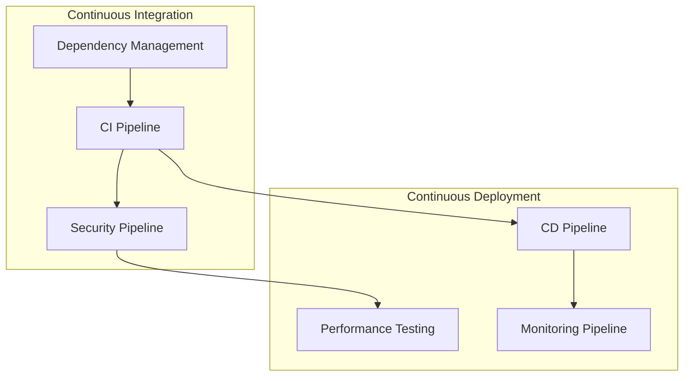

# 🚀 GitHub Actions Workflows Documentation

This directory contains comprehensive CI/CD workflows for the Agentic Startup Studio Boilerplate, implementing enterprise-grade automation and DevOps practices.

## 📋 Workflow Overview

| Workflow | Purpose | Trigger | Duration |
|----------|---------|---------|----------|
| **CI Pipeline** | Code quality, testing, security | Push, PR | ~15-20 min |
| **CD Pipeline** | Automated deployment | CI success, tags | ~25-30 min |
| **Security Pipeline** | Comprehensive security scanning | Push, PR, schedule | ~20-25 min |
| **Performance Testing** | Load, stress, benchmark testing | Push, schedule | ~30-40 min |
| **Monitoring Pipeline** | Health checks, alerting | Schedule (15min) | ~10-15 min |
| **Dependency Management** | Security updates, compliance | Schedule (daily) | ~15-20 min |

## 🔄 Workflow Dependencies



## 📊 Workflow Details

### 1. CI Pipeline (`ci.yml`)

**Purpose:** Comprehensive continuous integration with quality gates

**Jobs:**
- **Code Quality Checks:** Linting, formatting, type checking
- **Security Scanning:** SAST, dependency scanning, CodeQL
- **Unit Tests:** Multi-Python version testing with coverage
- **Integration Tests:** Database and service integration
- **Docker Build:** Container security scanning
- **Quality Gate:** Aggregate validation and approval

**Triggers:**
- Push to `main`, `develop` branches
- Pull requests to `main`, `develop`
- Excludes documentation-only changes

**Key Features:**
- Parallel job execution for speed
- Comprehensive test coverage (80% minimum)
- Security scanning with GitHub Security tab integration
- Multi-environment validation
- Artifact upload for test results

### 2. CD Pipeline (`cd.yml`)

**Purpose:** Automated deployment with blue-green strategy

**Jobs:**
- **CI Gate Check:** Validates CI pipeline success
- **Build and Push:** Container registry deployment
- **Deploy Staging:** Automated staging deployment
- **Performance Testing:** Load testing against staging
- **Security Testing:** DAST and container scanning
- **Deploy Production:** Blue-green production deployment
- **Post-Deployment Monitoring:** Health validation
- **Deployment Summary:** Comprehensive reporting

**Triggers:**
- Successful CI pipeline completion
- Push to `main` branch
- Git tags (`v*`)

**Key Features:**
- Container signing with Cosign
- SBOM generation for supply chain security
- Blue-green deployment strategy
- Automated rollback on failure
- Multi-environment promotion pipeline

### 3. Security Pipeline (`security.yml`)

**Purpose:** Advanced security testing and compliance validation

**Jobs:**
- **SAST Analysis:** Static code security scanning
- **Dependency Scanning:** Vulnerability detection
- **Container Security:** Image vulnerability scanning
- **IaC Security:** Infrastructure as Code validation
- **DAST Analysis:** Dynamic application security testing
- **Secrets Scanning:** Credential leak detection
- **Compliance Check:** GDPR, SOC 2 validation
- **Security Summary:** Aggregate reporting

**Triggers:**
- Push to any branch
- Pull requests
- Daily scheduled runs (2 AM UTC)
- Manual dispatch with scan type selection

**Key Features:**
- Multiple security tools integration
- Automated issue creation for failures
- SARIF format for GitHub Security integration
- Compliance framework validation
- Security metrics and trending

### 4. Performance Testing (`performance.yml`)

**Purpose:** Comprehensive performance validation and benchmarking

**Jobs:**
- **Setup Environment:** Test environment preparation
- **Load Testing:** Locust-based load testing
- **Stress Testing:** Artillery-based stress testing
- **Database Performance:** Database query benchmarking
- **Benchmark Testing:** Application function benchmarking
- **Cleanup:** Environment teardown
- **Performance Summary:** Results aggregation

**Triggers:**
- Push to `main` branch
- Pull requests to `main`
- Weekly scheduled runs (Sunday 3 AM UTC)
- Manual dispatch with test type selection

**Key Features:**
- Multiple performance testing tools
- Database performance validation
- Performance threshold enforcement
- Historical trend analysis
- Automated performance issue creation

### 5. Monitoring Pipeline (`monitoring.yml`)

**Purpose:** Continuous monitoring and observability validation

**Jobs:**
- **Health Checks:** Application endpoint validation
- **Performance Monitoring:** Response time tracking
- **Metrics Validation:** Prometheus metrics verification
- **Alert Validation:** Alert rule configuration checks
- **Dashboard Validation:** Grafana configuration validation
- **Incident Response:** Workflow simulation
- **Monitoring Summary:** Comprehensive reporting

**Triggers:**
- Every 15 minutes (scheduled)
- Push to `main` (monitoring config changes)
- Manual dispatch with check type selection

**Key Features:**
- Continuous health monitoring
- Performance threshold validation
- Alert configuration verification
- Incident response automation
- Monitoring metrics collection

### 6. Dependency Management (`dependency-management.yml`)

**Purpose:** Automated dependency updates and security management

**Jobs:**
- **Vulnerability Scanning:** Multi-tool vulnerability detection
- **License Compliance:** License validation and compliance
- **Dependency Updates:** Update analysis and recommendations
- **Security Updates:** Automated security patch application
- **Summary Report:** Comprehensive dependency reporting

**Triggers:**
- Daily scheduled runs (6 AM UTC)
- Changes to dependency files
- Manual dispatch with update type selection

**Key Features:**
- Multi-language dependency scanning
- License compliance validation
- Automated security updates via PRs
- Dependency trend analysis
- Supply chain security validation

## 🔧 Configuration Requirements

### Required Secrets

Create these secrets in your GitHub repository settings:

```bash
# Container Registry
GITHUB_TOKEN                 # Automatic (GitHub provides)

# Optional: External Services
SNYK_TOKEN                   # Snyk security scanning
GRAFANA_API_TOKEN           # Grafana dashboard updates
SLACK_WEBHOOK_URL           # Notification integration

# Optional: Cloud Deployment
AWS_ACCESS_KEY_ID           # AWS deployment
AWS_SECRET_ACCESS_KEY       # AWS deployment
AZURE_CREDENTIALS           # Azure deployment
GOOGLE_CREDENTIALS          # GCP deployment
```

### Required Repository Settings

1. **Branch Protection Rules:**
   ```bash
   # Main branch protection
   - Require status checks to pass
   - Require branches to be up to date
   - Require review from CODEOWNERS
   - Restrict pushes to specific users/teams
   ```

2. **Environment Configuration:**
   ```bash
   # Create environments: staging, production
   # Configure environment protection rules
   # Set environment-specific secrets
   ```

3. **GitHub Pages (Optional):**
   ```bash
   # Enable for documentation hosting
   # Configure source branch: gh-pages
   ```

## 🚀 Quick Start

1. **Initialize Workflows:**
   ```bash
   # Workflows are automatically active after merge
   # First run may require manual approval for environments
   ```

2. **Validate Configuration:**
   ```bash
   # Check workflow syntax
   act --list  # If using act for local testing
   
   # Validate Docker configurations
   docker-compose config
   ```

3. **Monitor Execution:**
   ```bash
   # GitHub Actions tab shows all workflow executions
   # Check artifacts for detailed reports
   # Review security findings in Security tab
   ```

## 📈 Monitoring and Observability

### Workflow Metrics

The implemented workflows provide comprehensive metrics:

- **CI/CD Success Rate:** Track deployment success/failure rates
- **Performance Trends:** Monitor application performance over time
- **Security Posture:** Track vulnerability counts and resolution
- **Test Coverage:** Monitor code coverage trends
- **Dependency Health:** Track dependency updates and vulnerabilities

### Alerting

Workflows automatically create GitHub Issues for:
- Security vulnerabilities requiring immediate attention
- Performance degradation beyond thresholds
- Deployment failures with rollback procedures
- Dependency management issues
- Monitoring and infrastructure problems

### Reporting

Each workflow generates detailed reports:
- **Test Results:** Coverage reports, test execution details
- **Security Reports:** Vulnerability scans, compliance status
- **Performance Reports:** Load testing results, benchmarks
- **Deployment Reports:** Deployment status, environment health
- **Dependency Reports:** Update recommendations, license compliance

## 🔄 Integration Points

### External Tools Integration

- **Slack:** Workflow notifications and alerts
- **Prometheus/Grafana:** Metrics collection and visualization
- **Snyk:** Advanced vulnerability scanning
- **SonarQube:** Code quality analysis (can be added)
- **Jira:** Issue tracking integration (can be added)

### Development Workflow Integration

- **Pre-commit Hooks:** Local validation before push
- **IDE Integration:** Workflow status in development environment
- **Pull Request Checks:** Automated validation and reporting
- **Code Review:** Automated review suggestions and security alerts

## 🛠️ Customization Guide

### Adding Custom Jobs

```yaml
# Example: Add custom job to CI pipeline
custom-validation:
  name: Custom Validation
  runs-on: ubuntu-latest
  steps:
    - name: Checkout code
      uses: actions/checkout@v4
    - name: Custom validation step
      run: |
        echo "Running custom validation..."
        # Add your custom logic here
```

### Environment-Specific Configuration

```yaml
# Configure different environments
environment:
  name: ${{ github.ref == 'refs/heads/main' && 'production' || 'staging' }}
  url: ${{ github.ref == 'refs/heads/main' && 'https://app.com' || 'https://staging.app.com' }}
```

### Conditional Execution

```yaml
# Run jobs conditionally
if: github.event_name == 'push' && contains(github.ref, 'refs/heads/main')
```

## 📚 Additional Resources

- [GitHub Actions Documentation](https://docs.github.com/en/actions)
- [Docker Best Practices](https://docs.docker.com/develop/dev-best-practices/)
- [Security Scanning Guide](https://docs.github.com/en/code-security)
- [Performance Testing Guidelines](https://docs.github.com/en/actions/using-workflows/events-that-trigger-workflows)

## 🤝 Contributing

When modifying workflows:

1. **Test Locally:** Use `act` or similar tools for local testing
2. **Update Documentation:** Keep this README current
3. **Version Control:** Use semantic versioning for workflow changes
4. **Security Review:** Have security team review security-related changes
5. **Performance Impact:** Consider workflow execution time and cost

---

**Last Updated:** $(date)  
**Workflow Version:** v2.0  
**Maintenance:** Automated via Dependency Management Pipeline