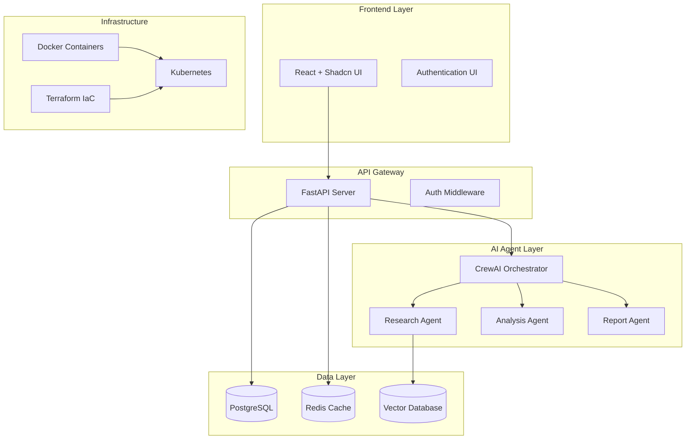

# Architecture Documentation

## System Overview

The Agentic Startup Studio Boilerplate provides a complete template structure for rapidly building AI-powered startups using CrewAI agents, FastAPI backends, and React frontends.

## Architecture Diagram



## Component Design

### 1. Template Structure
```
{{cookiecutter.project_slug}}/
├── backend/                 # FastAPI application
│   ├── app/
│   │   ├── models/         # SQLAlchemy models
│   │   ├── services/       # Business logic services
│   │   ├── api/           # API endpoints
│   │   ├── agents/        # CrewAI agent definitions
│   │   └── core/          # Configuration and utilities
│   ├── tests/             # Backend tests
│   └── requirements.txt   # Python dependencies
├── frontend/              # React application
│   ├── src/
│   │   ├── components/    # React components
│   │   ├── pages/         # Page components
│   │   ├── services/      # API client services
│   │   └── hooks/         # React hooks
│   ├── public/            # Static assets
│   └── package.json       # Node dependencies
├── infrastructure/        # Terraform configurations
│   ├── modules/           # Reusable Terraform modules
│   ├── environments/      # Environment-specific configs
│   └── scripts/           # Deployment scripts
└── docker-compose.yml     # Development environment
```

### 2. Data Flow

1. **User Request**: Frontend sends request to FastAPI
2. **Authentication**: Request validated through middleware
3. **Agent Orchestration**: FastAPI triggers CrewAI workflow
4. **Agent Execution**: Multiple agents collaborate on task
5. **Data Processing**: Results stored in database
6. **Response**: Processed results returned to frontend

### 3. Security Architecture

- **API Authentication**: JWT tokens with refresh mechanism
- **Agent Sandboxing**: Containerized agent execution
- **Data Encryption**: TLS in transit, AES-256 at rest
- **Input Validation**: Comprehensive sanitization
- **Rate Limiting**: Per-user and per-endpoint limits

### 4. Scalability Design

- **Horizontal Scaling**: Kubernetes pod autoscaling
- **Database Scaling**: Read replicas and connection pooling
- **Caching Strategy**: Multi-level caching with Redis
- **Agent Scaling**: Dynamic agent pool management
- **Load Balancing**: NGINX ingress controller

## Technology Decisions

### Backend Stack
- **FastAPI**: High-performance async framework
- **CrewAI**: Multi-agent orchestration platform
- **SQLAlchemy**: ORM with async support
- **Pydantic**: Data validation and serialization
- **Alembic**: Database migrations

### Frontend Stack
- **React 18**: Modern UI framework with concurrent features
- **Shadcn/UI**: Accessible component library
- **TanStack Query**: Server state management
- **React Router**: Client-side routing
- **Vite**: Fast build tool and dev server

### Infrastructure Stack
- **Docker**: Containerization platform
- **Kubernetes**: Container orchestration
- **Terraform**: Infrastructure as code
- **Prometheus**: Metrics collection
- **Grafana**: Monitoring dashboards

## Development Principles

1. **AI-First Design**: Architecture optimized for AI agent workflows
2. **Developer Experience**: Single-command environment setup
3. **Production Ready**: Enterprise-grade patterns from start
4. **Modular Design**: Loosely coupled, highly cohesive components
5. **Security by Default**: Secure defaults in all configurations

## Performance Characteristics

- **API Response Time**: <200ms (95th percentile)
- **Agent Coordination**: <5 seconds for complex workflows
- **Frontend Load Time**: <2 seconds initial load
- **Database Queries**: <50ms average query time
- **Concurrent Users**: 1000+ with horizontal scaling

## Deployment Strategy

### Development
- Docker Compose with hot-reload
- Local PostgreSQL and Redis instances
- Mock external services for testing

### Staging
- Kubernetes cluster with Helm charts
- Managed database services
- Integration with external APIs

### Production
- Multi-region Kubernetes deployment
- High-availability database clusters
- CDN for static assets
- Comprehensive monitoring and alerting