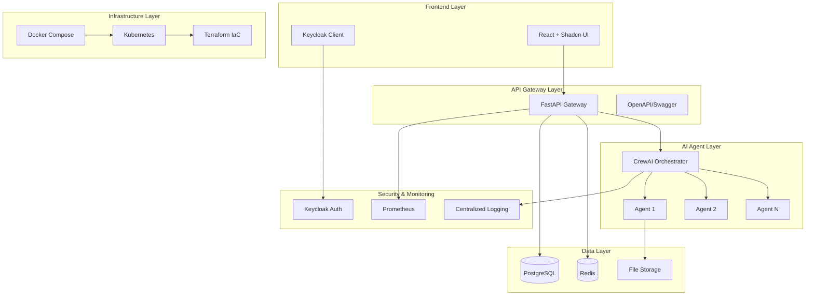
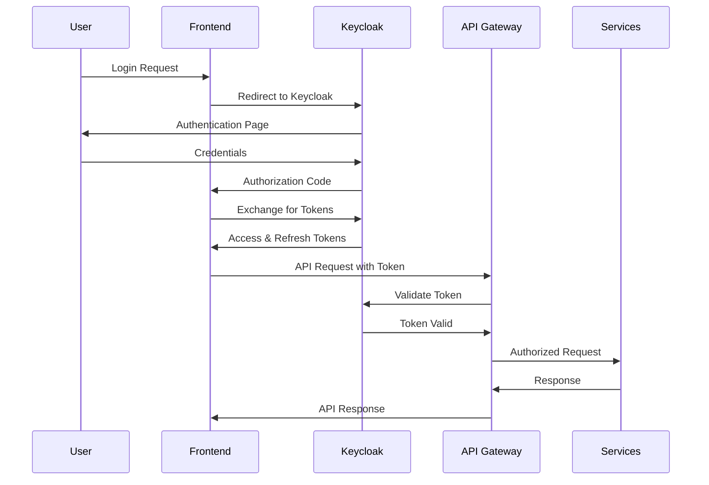

# System Architecture

## Architecture Overview

The Agentic Startup Studio Boilerplate follows a modern microservices architecture designed for rapid prototyping and production deployment of AI-powered applications.

## Component Details

### Frontend Layer

#### React Application
- **Technology**: React 18+ with TypeScript
- **UI Framework**: Shadcn/ui component library
- **State Management**: React Query for server state, Zustand for client state
- **Routing**: React Router v6
- **Build Tool**: Vite for fast development and optimized builds

#### Authentication Client
- **Technology**: Keycloak JavaScript adapter
- **Features**: OAuth 2.0, OIDC, social login integration
- **Security**: PKCE flow, secure token storage

### API Gateway Layer

#### FastAPI Application
- **Technology**: FastAPI with Python 3.9+
- **Features**: Automatic OpenAPI documentation, async/await support
- **Middleware**: CORS, authentication, rate limiting, request logging
- **Database**: SQLAlchemy ORM with Alembic migrations
- **Validation**: Pydantic models for request/response validation

#### API Documentation
- **Technology**: Built-in OpenAPI (Swagger) documentation
- **Features**: Interactive API explorer, schema validation
- **Security**: API key and JWT token authentication

### AI Agent Layer

#### CrewAI Orchestrator
- **Technology**: CrewAI framework for multi-agent coordination
- **Features**: Agent workflow management, task delegation, result aggregation
- **Communication**: Message passing between agents, event-driven architecture
- **Monitoring**: Agent performance metrics, task completion tracking

#### Individual Agents
- **Architecture**: Modular agent design with specific responsibilities
- **Communication**: RESTful API endpoints for agent interaction
- **State Management**: Persistent agent state with Redis caching
- **Extensibility**: Plugin-based architecture for custom agent types

### Data Layer

#### PostgreSQL Database
- **Technology**: PostgreSQL 15+ with connection pooling
- **Features**: ACID compliance, advanced indexing, full-text search
- **Backup**: Automated backups with point-in-time recovery
- **Scaling**: Read replicas for horizontal scaling

#### Redis Cache
- **Technology**: Redis 7+ for caching and session storage
- **Features**: In-memory data structure store, pub/sub messaging
- **Use Cases**: Session storage, API response caching, agent state caching
- **Clustering**: Redis Cluster for high availability

#### File Storage
- **Technology**: S3-compatible object storage
- **Features**: Scalable file storage, CDN integration
- **Security**: Signed URLs, access control policies
- **Backup**: Cross-region replication for disaster recovery

### Infrastructure Layer

#### Containerization
- **Technology**: Docker and Docker Compose
- **Features**: Multi-stage builds, optimized layer caching
- **Development**: Hot-reload support, volume mounting
- **Production**: Minimal runtime images, security scanning

#### Orchestration
- **Technology**: Kubernetes for production deployment
- **Features**: Auto-scaling, load balancing, health checks
- **Networking**: Service mesh with Istio for advanced traffic management
- **Storage**: Persistent volumes for stateful services

#### Infrastructure as Code
- **Technology**: Terraform for cloud resource provisioning
- **Features**: Multi-cloud support (AWS, GCP, Azure)
- **State Management**: Remote state with locking
- **Modules**: Reusable infrastructure components

### Security & Monitoring

#### Authentication & Authorization
- **Technology**: Keycloak identity provider
- **Features**: Multi-realm support, social login, MFA
- **Integration**: SAML, OIDC, LDAP integration
- **Security**: Password policies, session management

#### Metrics & Monitoring
- **Technology**: Prometheus for metrics collection
- **Visualization**: Grafana dashboards
- **Alerting**: AlertManager for critical alerts
- **APM**: Distributed tracing with Jaeger

#### Logging
- **Technology**: ELK stack (Elasticsearch, Logstash, Kibana)
- **Features**: Centralized log aggregation, search, and analysis
- **Retention**: Configurable log retention policies
- **Security**: Log encryption and access controls

## Data Flow

### Request Processing Flow
1. **User Request**: Frontend sends authenticated request to API Gateway
2. **Authentication**: FastAPI validates JWT token with Keycloak
3. **Routing**: Request routed to appropriate service endpoint
4. **Agent Coordination**: CrewAI orchestrator delegates tasks to agents
5. **Data Processing**: Agents process tasks and interact with data layer
6. **Response**: Results aggregated and returned to frontend

### Agent Communication Flow
1. **Task Creation**: API Gateway creates task for CrewAI orchestrator
2. **Agent Selection**: Orchestrator selects appropriate agents for task
3. **Task Distribution**: Tasks distributed to agents via message queue
4. **Processing**: Agents execute tasks and report progress
5. **Result Aggregation**: Orchestrator collects and combines results
6. **Response**: Final result returned to API Gateway

## Security Architecture

### Authentication Flow

### Security Layers
1. **Network Security**: TLS encryption, VPC isolation
2. **Application Security**: Input validation, SQL injection prevention
3. **Authentication**: Multi-factor authentication, session management
4. **Authorization**: Role-based access control (RBAC)
5. **Data Security**: Encryption at rest and in transit
6. **Container Security**: Image scanning, runtime protection

## Deployment Architecture

### Development Environment
- **Local Development**: Docker Compose with hot-reload
- **Testing**: Automated test execution in containers
- **Debugging**: Integrated debugging tools and log aggregation

### Staging Environment
- **Kubernetes Cluster**: Minikube or cloud-managed cluster
- **CI/CD Integration**: Automated deployment from Git branches
- **Testing**: Integration and end-to-end test execution

### Production Environment
- **Multi-Zone Deployment**: High availability across availability zones
- **Auto-Scaling**: Horizontal pod autoscaling based on metrics
- **Load Balancing**: Application load balancers with health checks
- **Disaster Recovery**: Cross-region backup and failover

## Performance Considerations

### Scalability Patterns
- **Horizontal Scaling**: Stateless services with load balancing
- **Caching Strategy**: Multi-level caching (CDN, API, database)
- **Database Optimization**: Read replicas, connection pooling
- **Async Processing**: Message queues for long-running tasks

### Performance Metrics
- **Response Time**: 95th percentile under 200ms
- **Throughput**: 1000+ requests per second
- **Availability**: 99.9% uptime SLA
- **Error Rate**: Less than 0.1% error rate

## Technology Decisions

### Architecture Decision Records (ADRs)
- [ADR-001: React Frontend Framework Selection](docs/adr/001-react-frontend.md)
- [ADR-002: FastAPI Backend Framework](docs/adr/002-fastapi-backend.md)
- [ADR-003: CrewAI Agent Orchestration](docs/adr/003-crewai-agents.md)
- [ADR-004: PostgreSQL Database Selection](docs/adr/004-postgresql-database.md)
- [ADR-005: Kubernetes Container Orchestration](docs/adr/005-kubernetes-orchestration.md)