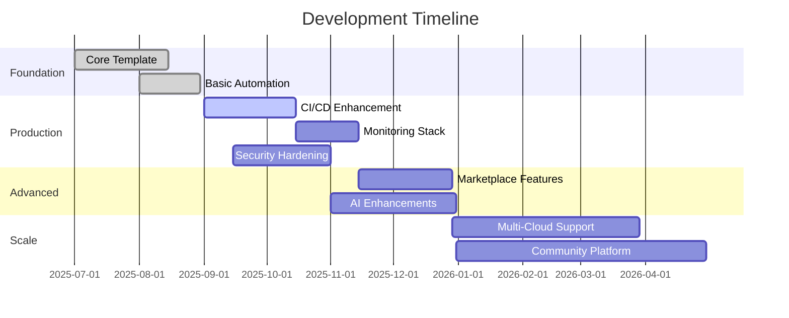

# Project Roadmap

## Vision
Transform agentic startup development by providing a comprehensive, production-ready boilerplate that reduces time-to-market from weeks to hours while maintaining enterprise-grade quality standards.

## Release Strategy

### v0.1.0 - Foundation (Current) ✅
**Status**: Released  
**Timeline**: Q3 2025  
**Theme**: Core template with basic automation

#### Completed Features
- [x] Cookiecutter template with project scaffolding
- [x] Basic CrewAI, FastAPI, React integration
- [x] Docker Compose development environment
- [x] Infrastructure-as-Code templates
- [x] Single-command development setup (`dev up`)
- [x] Repository hygiene automation
- [x] Security scanning framework
- [x] Basic CI/CD foundations

#### Key Deliverables
- Working template for rapid project creation
- Development environment with hot-reload
- Basic security and quality gates
- Documentation and contribution guidelines

---

### v0.2.0 - Production Readiness (In Progress) 🚧
**Status**: In Development  
**Timeline**: Q4 2025  
**Theme**: Enterprise-grade deployment and monitoring

#### Planned Features
- [ ] **Enhanced CI/CD Pipeline**
  - Multi-stage build optimization
  - Comprehensive test coverage (unit, integration, e2e)
  - Automated security scanning (SAST, DAST, dependency)
  - Performance regression testing
  
- [ ] **Production Deployment**
  - Multi-environment configuration (dev, staging, prod)
  - Blue-green deployment strategies
  - Database migration management
  - Container registry integration
  
- [ ] **Monitoring & Observability**
  - Prometheus metrics collection
  - Grafana dashboards
  - Distributed tracing with Jaeger
  - Centralized logging (ELK stack)
  - APM integration
  
- [ ] **Security Hardening**
  - OWASP Top 10 compliance
  - Container security scanning
  - Secrets management integration
  - Security policy as code
  
- [ ] **Advanced Agent Capabilities**
  - Multi-agent workflow examples
  - Agent performance monitoring
  - Task queue management
  - Agent state persistence

#### Success Metrics
- 99.9% deployment success rate
- Sub-200ms API response times
- 100% security scan pass rate
- Complete observability coverage

---

### v0.3.0 - Advanced Features (Planned) 📋
**Status**: Planning  
**Timeline**: Q1 2026  
**Theme**: Advanced integrations and ecosystem expansion

#### Planned Features
- [ ] **Marketplace Integrations**
  - Stripe payment processing
  - SendGrid email automation
  - Twilio SMS/voice integration
  - Social media API connectors
  
- [ ] **Advanced AI Features**
  - Model fine-tuning workflows
  - Vector database integration
  - RAG (Retrieval-Augmented Generation) patterns
  - Multi-modal agent capabilities
  
- [ ] **Enterprise Features**
  - Multi-tenant architecture
  - Advanced RBAC with Keycloak
  - Audit logging and compliance
  - Data governance frameworks
  
- [ ] **Developer Experience**
  - VS Code extension for template management
  - Interactive setup wizard
  - Live preview environment
  - Template marketplace

#### Key Initiatives
- Partner ecosystem development
- Enterprise customer onboarding
- Community-driven template extensions
- Performance optimization framework

---

### v0.4.0 - Scale & Ecosystem (Future) 🌟
**Status**: Conceptual  
**Timeline**: Q2 2026  
**Theme**: Scaling and ecosystem maturation

#### Vision Features
- [ ] **Auto-Scaling Intelligence**
  - ML-based resource optimization
  - Predictive scaling algorithms
  - Cost optimization recommendations
  - Performance tuning automation
  
- [ ] **Multi-Cloud Support**
  - Vendor-agnostic deployment
  - Cloud cost optimization
  - Disaster recovery automation
  - Geographic distribution
  
- [ ] **AI-Powered Development**
  - Code generation assistants
  - Automated testing generation
  - Performance optimization suggestions
  - Security vulnerability auto-fixing
  
- [ ] **Community Platform**
  - Template sharing marketplace
  - Agent library ecosystem
  - Best practices repository
  - Expert consultation network

---

## Milestones & Dependencies

### Critical Path Dependencies

### Risk Mitigation Timeline
- **Technical Debt Review**: Monthly architecture reviews
- **Security Audits**: Quarterly penetration testing
- **Performance Benchmarks**: Continuous performance monitoring
- **Dependency Updates**: Automated weekly updates with testing

---

## Success Metrics by Release

### v0.2.0 Targets
- **Deployment Success Rate**: >99.5%
- **Test Coverage**: >90% (unit), >80% (integration)
- **Security Score**: OpenSSF Scorecard >8.0
- **Performance**: <200ms API response time (95th percentile)
- **Documentation**: 100% API coverage, comprehensive guides

### v0.3.0 Targets  
- **Community Adoption**: 1000+ template downloads
- **Enterprise Customers**: 10+ paying enterprise clients
- **Marketplace**: 50+ community-contributed templates
- **Performance**: <100ms API response time (95th percentile)

### v0.4.0 Targets
- **Scale**: Support for 10,000+ concurrent users
- **Multi-Cloud**: Deployment across 3+ cloud providers
- **Ecosystem**: 500+ community contributors
- **Intelligence**: 80% automated optimization recommendations

---

## Feature Request Process

### Community Input
1. **GitHub Issues**: Feature requests and bug reports
2. **Monthly Community Calls**: Direct feedback sessions
3. **User Surveys**: Quarterly needs assessment
4. **Enterprise Feedback**: Dedicated account management

### Prioritization Framework
- **Impact**: User base affected and business value
- **Effort**: Development complexity and resource requirements
- **Strategic Alignment**: Roadmap consistency and vision alignment
- **Technical Debt**: Maintenance burden and architecture impact

### Release Planning
- **Quarterly Planning**: Major feature prioritization
- **Bi-weekly Sprints**: Implementation and testing cycles
- **Monthly Reviews**: Progress assessment and scope adjustment
- **Continuous Deployment**: Feature flags for gradual rollouts

---

## Technology Evolution

### Framework Updates
- **React**: Maintain compatibility with latest stable releases
- **FastAPI**: Leverage new async capabilities and performance improvements
- **CrewAI**: Track agent orchestration advances and integration opportunities
- **Kubernetes**: Adopt new features for improved deployment and scaling

### Emerging Technologies
- **WebAssembly**: Investigate client-side agent execution
- **GraphQL**: Consider API evolution beyond REST
- **Serverless**: Evaluate FaaS integration for specific use cases
- **Edge Computing**: Explore CDN-based agent deployment

### Architecture Evolution
- **Microservices**: Continue modular architecture refinement
- **Event-Driven**: Enhance async communication patterns
- **Observability**: Deepen telemetry and monitoring capabilities
- **Security**: Implement zero-trust architecture principles