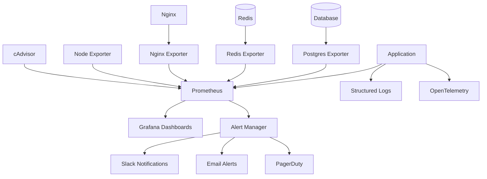

# Monitoring & Observability Guide

This guide covers the comprehensive monitoring and observability setup for the Agentic Startup Studio Boilerplate.

## Overview

Our monitoring strategy follows the three pillars of observability:
- **Metrics**: Quantitative measurements of system behavior (Prometheus)
- **Logs**: Event records with contextual information (Structured logging)
- **Traces**: Request flow across distributed services (OpenTelemetry)

## Architecture



## Metrics Collection

### Application Metrics

The application exposes metrics via `/metrics` endpoint using the Prometheus Python client:

```python
from prometheus_client import Counter, Histogram, Gauge, start_http_server

# Request metrics
REQUEST_COUNT = Counter('http_requests_total', 'Total HTTP requests', ['method', 'endpoint', 'status'])
REQUEST_DURATION = Histogram('http_request_duration_seconds', 'HTTP request duration')

# Business metrics
USER_REGISTRATIONS = Counter('user_registrations_total', 'Total user registrations')
ACTIVE_USERS = Gauge('active_users', 'Number of active users')

# AI/ML metrics
MODEL_INFERENCE_TIME = Histogram('model_inference_duration_seconds', 'Model inference time')
MODEL_REQUESTS = Counter('model_requests_total', 'Total model requests', ['model', 'status'])

# Agent metrics
AGENT_TASKS_STARTED = Counter('agent_tasks_started_total', 'Agent tasks started', ['agent_type'])
AGENT_TASKS_COMPLETED = Counter('agent_tasks_completed_total', 'Agent tasks completed', ['agent_type', 'status'])
AGENT_TASK_DURATION = Histogram('agent_task_duration_seconds', 'Agent task duration', ['agent_type'])
```

### Infrastructure Metrics

#### System Metrics (Node Exporter)
- CPU usage, memory usage, disk I/O
- Network statistics, filesystem usage
- System load, process statistics

#### Container Metrics (cAdvisor)
- Container resource usage (CPU, memory, network)
- Container lifecycle events
- Per-container performance metrics

#### Database Metrics (Postgres Exporter)
- Connection pool usage
- Query performance and slow queries
- Transaction rates and lock statistics
- Table and index statistics

#### Cache Metrics (Redis Exporter)
- Memory usage and hit rates
- Command statistics
- Replication lag and persistence stats

### Custom Metrics

#### CrewAI Agent Metrics
```python
from crewai import Agent, Task, Crew
from prometheus_client import Counter, Histogram

class MonitoredAgent(Agent):
    def __init__(self, *args, **kwargs):
        super().__init__(*args, **kwargs)
        self.task_counter = Counter('crew_agent_tasks_total', 'Agent tasks', ['agent_role'])
        self.task_duration = Histogram('crew_agent_task_duration_seconds', 'Task duration', ['agent_role'])
    
    def execute_task(self, task):
        with self.task_duration.labels(agent_role=self.role).time():
            result = super().execute_task(task)
            self.task_counter.labels(agent_role=self.role).inc()
            return result
```

#### API Performance Metrics
```python
from fastapi import FastAPI, Request
import time

app = FastAPI()

@app.middleware("http")
async def metrics_middleware(request: Request, call_next):
    start_time = time.time()
    
    response = await call_next(request)
    
    # Record metrics
    REQUEST_COUNT.labels(
        method=request.method,
        endpoint=str(request.url.path),
        status=response.status_code
    ).inc()
    
    REQUEST_DURATION.observe(time.time() - start_time)
    
    return response
```

## Alerting

### Alert Categories

#### Critical Alerts (Immediate Response)
- Service downtime
- High error rates (>5%)
- Database connection failures
- Memory/disk exhaustion
- Security incidents

#### Warning Alerts (Response within 1 hour)
- High response times
- Resource usage above 80%
- Elevated error rates (1-5%)
- Performance degradation

#### Info Alerts (Response within 24 hours)
- Capacity planning warnings
- Business metric anomalies
- Maintenance reminders

### Alert Rules

#### Service Availability
```yaml
- alert: ServiceDown
  expr: up == 0
  for: 1m
  labels:
    severity: critical
  annotations:
    summary: "Service {{ $labels.job }} is down"
    description: "Service has been down for more than 1 minute"
```

#### Performance Alerts
```yaml
- alert: HighResponseTime
  expr: http_request_duration_p95 > 1.0
  for: 10m
  labels:
    severity: warning
  annotations:
    summary: "High response time detected"
    description: "95th percentile response time is {{ $value }}s"
```

#### AI/ML Specific Alerts
```yaml
- alert: ModelInferenceFailures
  expr: rate(model_requests_total{status="error"}[5m]) > 0.05
  for: 5m
  labels:
    severity: warning
  annotations:
    summary: "High model inference failure rate"
    description: "Model failure rate is {{ $value | humanizePercentage }}"
```

### Notification Channels

#### Slack Integration
```yaml
# alertmanager.yml
global:
  slack_api_url: 'YOUR_SLACK_WEBHOOK_URL'

route:
  group_by: ['alertname']
  group_wait: 10s
  group_interval: 10s
  repeat_interval: 1h
  receiver: 'web.hook'

receivers:
- name: 'web.hook'
  slack_configs:
  - channel: '#alerts'
    title: 'Alert: {{ range .Alerts }}{{ .Annotations.summary }}{{ end }}'
    text: '{{ range .Alerts }}{{ .Annotations.description }}{{ end }}'
```

#### Email Notifications
```yaml
receivers:
- name: 'email-alerts'
  email_configs:
  - to: 'ops-team@company.com'
    subject: 'Alert: {{ .GroupLabels.alertname }}'
    body: |
      {{ range .Alerts }}
      Alert: {{ .Annotations.summary }}
      Description: {{ .Annotations.description }}
      {{ end }}
```

## Dashboards

### Application Dashboard

Key metrics displayed:
- Request rate and response times
- Error rates by endpoint
- Active users and sessions
- Database query performance
- Cache hit rates

### Infrastructure Dashboard

System metrics:
- CPU, memory, and disk usage
- Network I/O and bandwidth
- Container resource utilization
- Service health status

### AI/ML Dashboard

Specialized metrics:
- Model inference times and success rates
- Agent task completion rates
- CrewAI workflow performance
- Token usage and costs

### Business Dashboard

Business-critical metrics:
- User registration trends
- API usage patterns
- Revenue-impacting metrics
- Feature adoption rates

## Logging Strategy

### Structured Logging

Use JSON format for all application logs:

```python
import logging
import json
from datetime import datetime

class JSONFormatter(logging.Formatter):
    def format(self, record):
        log_entry = {
            'timestamp': datetime.utcnow().isoformat(),
            'level': record.levelname,
            'logger': record.name,
            'message': record.getMessage(),
            'module': record.module,
            'function': record.funcName,
            'line': record.lineno
        }
        
        # Add extra context if available
        if hasattr(record, 'user_id'):
            log_entry['user_id'] = record.user_id
        if hasattr(record, 'request_id'):
            log_entry['request_id'] = record.request_id
            
        return json.dumps(log_entry)

# Configure logging
logging.basicConfig(
    level=logging.INFO,
    handlers=[logging.StreamHandler()],
    format='%(message)s'
)

logger = logging.getLogger(__name__)
logger.addHandler(logging.StreamHandler())
logger.handlers[0].setFormatter(JSONFormatter())
```

### Log Levels

- **DEBUG**: Detailed diagnostic information
- **INFO**: General application flow
- **WARNING**: Unexpected situations that don't cause errors
- **ERROR**: Error conditions that need attention
- **CRITICAL**: Serious errors that may cause application failure

### Log Aggregation

Use centralized logging with log shipping:

```yaml
# docker-compose.yml
services:
  app:
    logging:
      driver: "json-file"
      options:
        max-size: "10m"
        max-file: "3"
        labels: "service,environment"
```

## Tracing (Optional)

### OpenTelemetry Integration

```python
from opentelemetry import trace
from opentelemetry.exporter.jaeger.thrift import JaegerExporter
from opentelemetry.sdk.trace import TracerProvider
from opentelemetry.sdk.trace.export import BatchSpanProcessor

# Configure tracing
trace.set_tracer_provider(TracerProvider())
tracer = trace.get_tracer(__name__)

jaeger_exporter = JaegerExporter(
    agent_host_name="jaeger",
    agent_port=6831,
)

span_processor = BatchSpanProcessor(jaeger_exporter)
trace.get_tracer_provider().add_span_processor(span_processor)

# Use in application
@app.get("/api/users/{user_id}")
async def get_user(user_id: str):
    with tracer.start_as_current_span("get_user") as span:
        span.set_attribute("user.id", user_id)
        
        # Database query span
        with tracer.start_as_current_span("db_query") as db_span:
            user = await database.get_user(user_id)
            db_span.set_attribute("db.table", "users")
            
        return user
```

## Health Checks

### Application Health Check

```python
from fastapi import FastAPI, status
from fastapi.responses import JSONResponse

@app.get("/health")
async def health_check():
    checks = {
        "database": await check_database(),
        "redis": await check_redis(),
        "external_apis": await check_external_apis()
    }
    
    all_healthy = all(checks.values())
    
    return JSONResponse(
        status_code=status.HTTP_200_OK if all_healthy else status.HTTP_503_SERVICE_UNAVAILABLE,
        content={
            "status": "healthy" if all_healthy else "unhealthy",
            "timestamp": datetime.utcnow().isoformat(),
            "checks": checks
        }
    )

async def check_database():
    try:
        await database.execute("SELECT 1")
        return True
    except Exception:
        return False
```

### Deep Health Checks

```python
@app.get("/health/deep")
async def deep_health_check():
    checks = {
        "database_write": await check_database_write(),
        "ai_model": await check_ai_model(),
        "external_apis": await check_all_external_apis(),
        "file_storage": await check_file_storage()
    }
    
    return {
        "status": "healthy" if all(checks.values()) else "degraded",
        "checks": checks,
        "version": app.version
    }
```

## Performance Monitoring

### SLA Monitoring

Track key performance indicators:
- **Availability**: 99.9% uptime target
- **Response Time**: 95th percentile < 200ms
- **Error Rate**: < 0.1% for critical endpoints
- **Throughput**: Support 1000+ requests/second

### Real User Monitoring (RUM)

Frontend performance monitoring:

```javascript
// Frontend performance monitoring
const performanceObserver = new PerformanceObserver((list) => {
  list.getEntries().forEach((entry) => {
    // Send performance data to analytics
    analytics.track('page_performance', {
      url: entry.name,
      loadTime: entry.loadEventEnd - entry.fetchStart,
      domContentLoaded: entry.domContentLoadedEventEnd - entry.fetchStart,
      firstContentfulPaint: entry.responseEnd - entry.fetchStart
    });
  });
});

performanceObserver.observe({ entryTypes: ['navigation', 'measure'] });
```

## Runbooks

### Standard Operating Procedures

Create runbooks for common scenarios:
- [Service Down](../runbooks/service-down.md)
- [High Error Rate](../runbooks/high-error-rate.md)
- [Database Issues](../runbooks/database-issues.md)
- [Performance Issues](../runbooks/performance-issues.md)

### Incident Response

1. **Detection**: Automated alerts trigger incident response
2. **Triage**: Assess severity and impact
3. **Mitigation**: Implement immediate fixes
4. **Resolution**: Address root cause
5. **Post-mortem**: Document lessons learned

## Security Monitoring

### Security Metrics

```python
# Security-related metrics
FAILED_LOGINS = Counter('auth_failed_attempts_total', 'Failed login attempts', ['ip', 'user'])
SUSPICIOUS_REQUESTS = Counter('suspicious_requests_total', 'Suspicious HTTP requests', ['type'])
RATE_LIMIT_HITS = Counter('rate_limit_hits_total', 'Rate limit violations', ['endpoint'])
```

### Security Alerts

```yaml
- alert: HighFailedLogins
  expr: rate(auth_failed_attempts_total[5m]) > 0.5
  for: 10m
  labels:
    severity: warning
    category: security
  annotations:
    summary: "High rate of failed login attempts"
    description: "{{ $value }} failed attempts per second"
```

## Cost Monitoring

### Resource Cost Tracking

Monitor cloud costs and resource utilization:
- Container resource usage vs. allocation
- Database query costs and optimization opportunities
- AI/ML API usage and token consumption
- Storage costs and optimization

## Best Practices

### Monitoring Best Practices

1. **Four Golden Signals**: Latency, Traffic, Errors, Saturation
2. **SLI/SLO Definition**: Clear service level objectives
3. **Alert Fatigue Prevention**: Meaningful alerts only
4. **Runbook Maintenance**: Keep incident procedures updated
5. **Regular Reviews**: Monthly monitoring effectiveness reviews

### Dashboard Design

1. **User-Focused**: Design for specific personas
2. **Hierarchical**: Overview → Detail drill-down
3. **Actionable**: Include links to runbooks and tools
4. **Consistent**: Standardized colors, units, and layouts
5. **Fresh**: Regular updates and relevance checks

### Alert Design

1. **Actionable**: Every alert should require an action
2. **Specific**: Clear problem description and context
3. **Tiered**: Appropriate severity levels
4. **Documented**: Link to relevant runbooks
5. **Tested**: Regular testing of alert conditions

## Troubleshooting

### Common Issues

1. **High Cardinality Metrics**: Limit label combinations
2. **Storage Issues**: Configure retention and compression
3. **Alert Fatigue**: Review and tune alert thresholds
4. **Dashboard Performance**: Optimize queries and time ranges

### Performance Optimization

```python
# Optimize metric collection
from prometheus_client import CollectorRegistry, CONTENT_TYPE_LATEST, generate_latest

# Use custom registry for expensive metrics
expensive_registry = CollectorRegistry()

@app.get("/metrics/expensive")
async def expensive_metrics():
    return Response(
        generate_latest(expensive_registry),
        media_type=CONTENT_TYPE_LATEST
    )
```

## Resources

- [Prometheus Documentation](https://prometheus.io/docs/)
- [Grafana Documentation](https://grafana.com/docs/)
- [OpenTelemetry Python](https://opentelemetry-python.readthedocs.io/)
- [SRE Book - Monitoring](https://sre.google/sre-book/monitoring-distributed-systems/)
- [Prometheus Best Practices](https://prometheus.io/docs/practices/naming/)